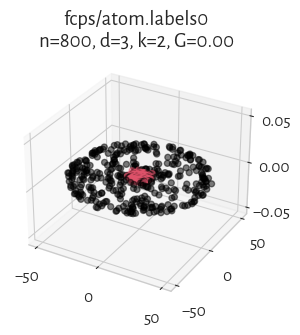
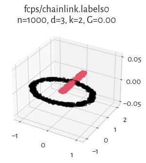
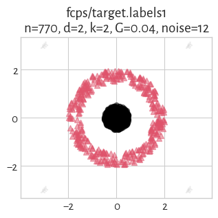
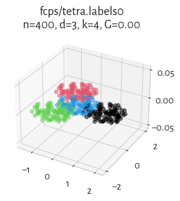
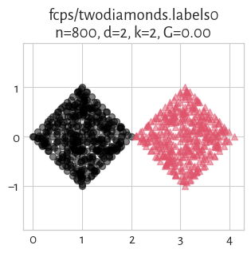

The **[Framework for Benchmarking Clustering Algorithms](https://clustering-benchmarks.gagolewski.com)
is authored/edited/maintained by [Marek Gagolewski](https://www.gagolewski.com)**

[Benchmark suite](https://github.com/gagolews/clustering-data-v1) version 1.1.0

--------------------------------------------------------------------------------

**Datasets**

* [fcps/atom](#atom)
* [fcps/chainlink](#chainlink)
* [fcps/engytime](#engytime)
* [fcps/hepta](#hepta)
* [fcps/lsun](#lsun)
* [fcps/target](#target)
* [fcps/tetra](#tetra)
* [fcps/twodiamonds](#twodiamonds)
* [fcps/wingnut](#wingnut)

--------------------------------------------------------------------------------

## fcps/atom (n=800, d=3) 

## fcps/chainlink (n=1000, d=3) 

## fcps/engytime (n=4096, d=2) 

## fcps/hepta (n=212, d=3) 

## fcps/lsun (n=400, d=2) 

## fcps/target (n=770, d=2) 

## fcps/tetra (n=400, d=3) 

## fcps/twodiamonds (n=800, d=2) 

## fcps/wingnut (n=1016, d=2) 

