The **[Framework for Benchmarking Clustering Algorithms](https://clustering-benchmarks.gagolewski.com)
is authored/edited/maintained by [Marek Gagolewski](https://www.gagolewski.com)**

[Benchmark suite](https://github.com/gagolews/clustering-data-v1) version 1.1.0

--------------------------------------------------------------------------------

**Datasets**

* [graves/dense](#dense)
* [graves/fuzzyx](#fuzzyx)
* [graves/line](#line)
* [graves/parabolic](#parabolic)
* [graves/ring](#ring)
* [graves/ring_noisy](#ring_noisy)
* [graves/ring_outliers](#ring_outliers)
* [graves/zigzag](#zigzag)
* [graves/zigzag_noisy](#zigzag_noisy)
* [graves/zigzag_outliers](#zigzag_outliers)

--------------------------------------------------------------------------------

## graves/dense (n=200, d=2) 

## graves/fuzzyx (n=1000, d=2) 

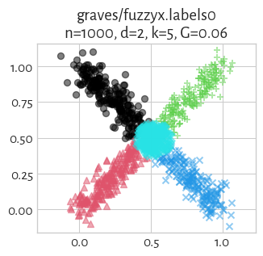
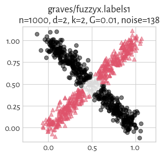
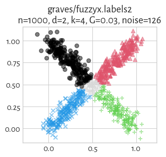
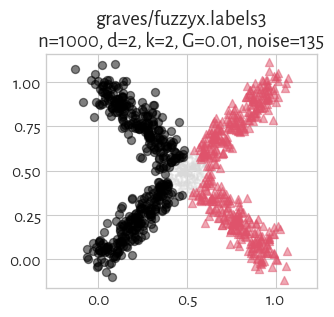
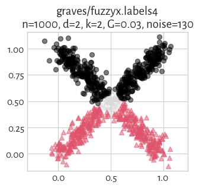

## graves/line (n=250, d=2) 

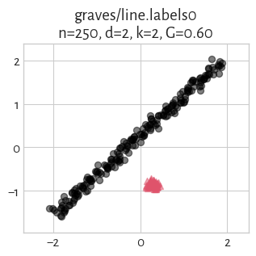

## graves/parabolic (n=1000, d=2) 

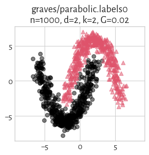
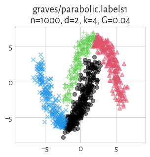

## graves/ring (n=1000, d=2) 

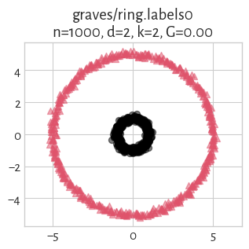

## graves/ring_noisy (n=1050, d=2) 

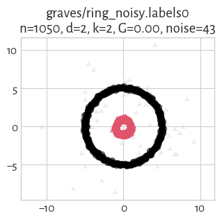

## graves/ring_outliers (n=1030, d=2) 

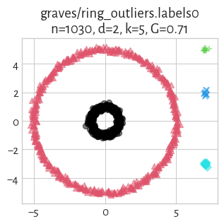
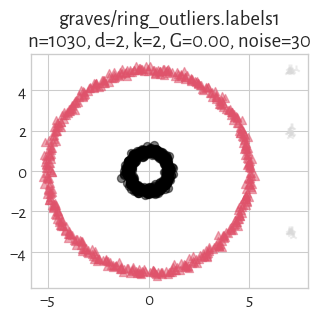

## graves/zigzag (n=250, d=2) 

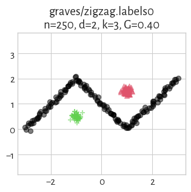
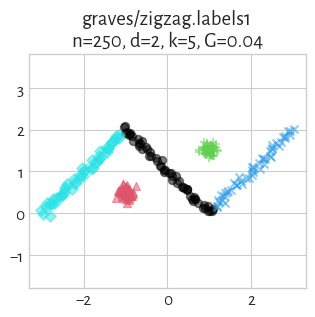

## graves/zigzag_noisy (n=300, d=2) 

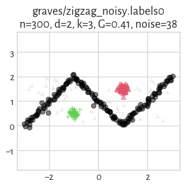
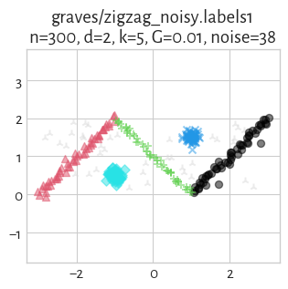

## graves/zigzag_outliers (n=280, d=2) 

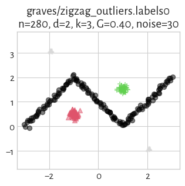
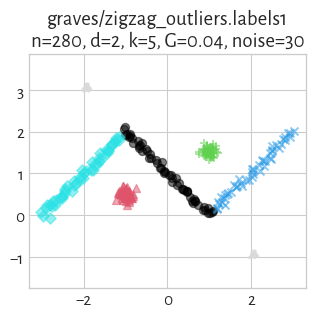

