The **[Framework for Benchmarking Clustering Algorithms](https://clustering-benchmarks.gagolewski.com)
is authored/edited/maintained by [Marek Gagolewski](https://www.gagolewski.com)**

[Benchmark suite](https://github.com/gagolews/clustering-data-v1) version 1.1.0

--------------------------------------------------------------------------------

**Datasets**

* [h2mg/h2mg_1_10](#h2mg_1_10)
* [h2mg/h2mg_1_20](#h2mg_1_20)
* [h2mg/h2mg_1_30](#h2mg_1_30)
* [h2mg/h2mg_1_40](#h2mg_1_40)
* [h2mg/h2mg_1_50](#h2mg_1_50)
* [h2mg/h2mg_1_60](#h2mg_1_60)
* [h2mg/h2mg_1_70](#h2mg_1_70)
* [h2mg/h2mg_1_80](#h2mg_1_80)
* [h2mg/h2mg_1_90](#h2mg_1_90)
* [h2mg/h2mg_2_10](#h2mg_2_10)
* [h2mg/h2mg_2_20](#h2mg_2_20)
* [h2mg/h2mg_2_30](#h2mg_2_30)
* [h2mg/h2mg_2_40](#h2mg_2_40)
* [h2mg/h2mg_2_50](#h2mg_2_50)
* [h2mg/h2mg_2_60](#h2mg_2_60)
* [h2mg/h2mg_2_70](#h2mg_2_70)
* [h2mg/h2mg_2_80](#h2mg_2_80)
* [h2mg/h2mg_2_90](#h2mg_2_90)
* [h2mg/h2mg_4_10](#h2mg_4_10)
* [h2mg/h2mg_4_20](#h2mg_4_20)
* [h2mg/h2mg_4_30](#h2mg_4_30)
* [h2mg/h2mg_4_40](#h2mg_4_40)
* [h2mg/h2mg_4_50](#h2mg_4_50)
* [h2mg/h2mg_4_60](#h2mg_4_60)
* [h2mg/h2mg_4_70](#h2mg_4_70)
* [h2mg/h2mg_4_80](#h2mg_4_80)
* [h2mg/h2mg_4_90](#h2mg_4_90)
* [h2mg/h2mg_8_10](#h2mg_8_10)
* [h2mg/h2mg_8_20](#h2mg_8_20)
* [h2mg/h2mg_8_30](#h2mg_8_30)
* [h2mg/h2mg_8_40](#h2mg_8_40)
* [h2mg/h2mg_8_50](#h2mg_8_50)
* [h2mg/h2mg_8_60](#h2mg_8_60)
* [h2mg/h2mg_8_70](#h2mg_8_70)
* [h2mg/h2mg_8_80](#h2mg_8_80)
* [h2mg/h2mg_8_90](#h2mg_8_90)
* [h2mg/h2mg_16_10](#h2mg_16_10)
* [h2mg/h2mg_16_20](#h2mg_16_20)
* [h2mg/h2mg_16_30](#h2mg_16_30)
* [h2mg/h2mg_16_40](#h2mg_16_40)
* [h2mg/h2mg_16_50](#h2mg_16_50)
* [h2mg/h2mg_16_60](#h2mg_16_60)
* [h2mg/h2mg_16_70](#h2mg_16_70)
* [h2mg/h2mg_16_80](#h2mg_16_80)
* [h2mg/h2mg_16_90](#h2mg_16_90)
* [h2mg/h2mg_32_10](#h2mg_32_10)
* [h2mg/h2mg_32_20](#h2mg_32_20)
* [h2mg/h2mg_32_30](#h2mg_32_30)
* [h2mg/h2mg_32_40](#h2mg_32_40)
* [h2mg/h2mg_32_50](#h2mg_32_50)
* [h2mg/h2mg_32_60](#h2mg_32_60)
* [h2mg/h2mg_32_70](#h2mg_32_70)
* [h2mg/h2mg_32_80](#h2mg_32_80)
* [h2mg/h2mg_32_90](#h2mg_32_90)
* [h2mg/h2mg_64_10](#h2mg_64_10)
* [h2mg/h2mg_64_20](#h2mg_64_20)
* [h2mg/h2mg_64_30](#h2mg_64_30)
* [h2mg/h2mg_64_40](#h2mg_64_40)
* [h2mg/h2mg_64_50](#h2mg_64_50)
* [h2mg/h2mg_64_60](#h2mg_64_60)
* [h2mg/h2mg_64_70](#h2mg_64_70)
* [h2mg/h2mg_64_80](#h2mg_64_80)
* [h2mg/h2mg_64_90](#h2mg_64_90)
* [h2mg/h2mg_128_10](#h2mg_128_10)
* [h2mg/h2mg_128_20](#h2mg_128_20)
* [h2mg/h2mg_128_30](#h2mg_128_30)
* [h2mg/h2mg_128_40](#h2mg_128_40)
* [h2mg/h2mg_128_50](#h2mg_128_50)
* [h2mg/h2mg_128_60](#h2mg_128_60)
* [h2mg/h2mg_128_70](#h2mg_128_70)
* [h2mg/h2mg_128_80](#h2mg_128_80)
* [h2mg/h2mg_128_90](#h2mg_128_90)

--------------------------------------------------------------------------------

## h2mg/h2mg_1_10 (n=2048, d=1) 

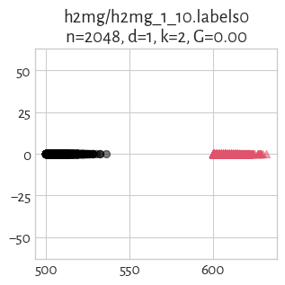
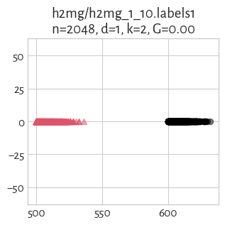

## h2mg/h2mg_1_20 (n=2048, d=1) 

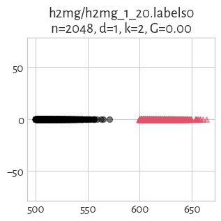
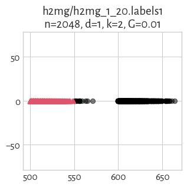

## h2mg/h2mg_1_30 (n=2048, d=1) 

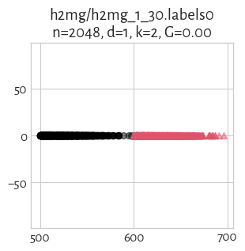
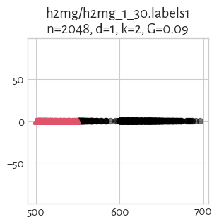

## h2mg/h2mg_1_40 (n=2048, d=1) 

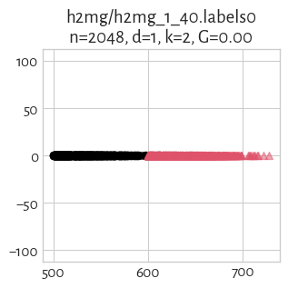

## h2mg/h2mg_1_50 (n=2048, d=1) 

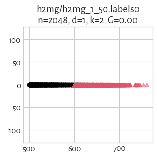
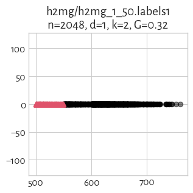

## h2mg/h2mg_1_60 (n=2048, d=1) 

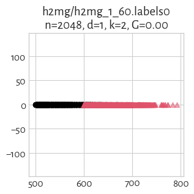
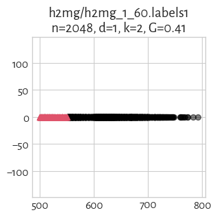

## h2mg/h2mg_1_70 (n=2048, d=1) 

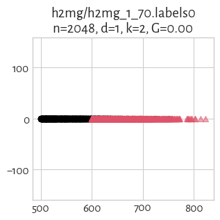
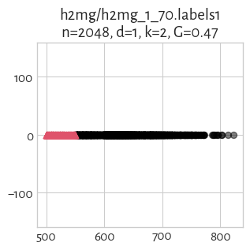

## h2mg/h2mg_1_80 (n=2048, d=1) 

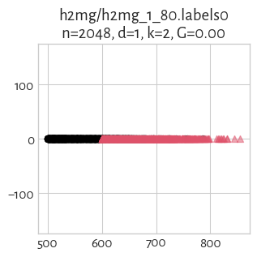
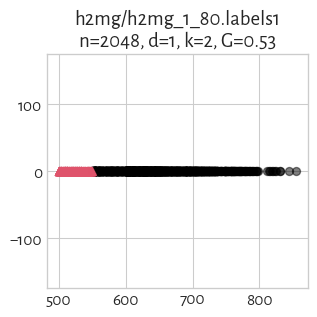

## h2mg/h2mg_1_90 (n=2048, d=1) 

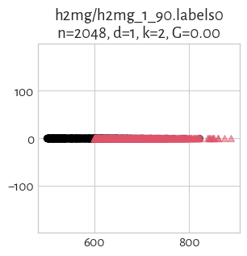
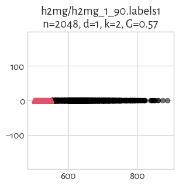

## h2mg/h2mg_2_10 (n=2048, d=2) 

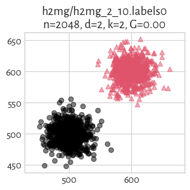
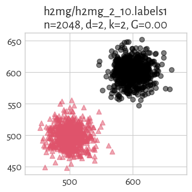

## h2mg/h2mg_2_20 (n=2048, d=2) 

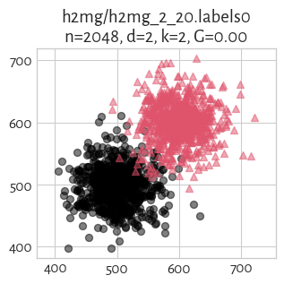
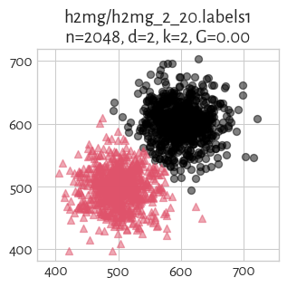

## h2mg/h2mg_2_30 (n=2048, d=2) 

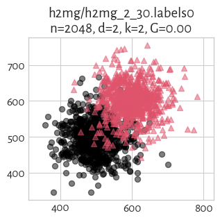
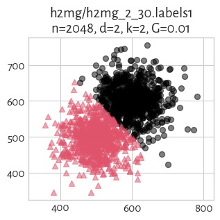

## h2mg/h2mg_2_40 (n=2048, d=2) 

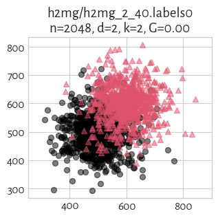
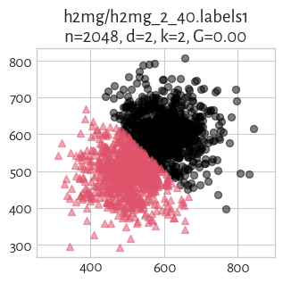

## h2mg/h2mg_2_50 (n=2048, d=2) 

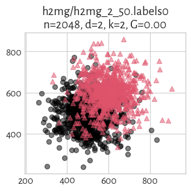
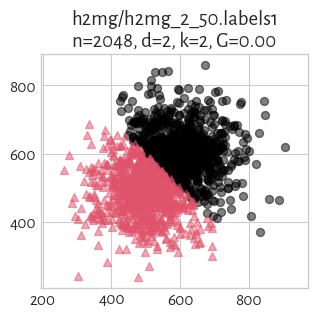

## h2mg/h2mg_2_60 (n=2048, d=2) 

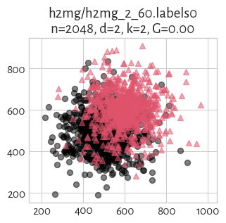
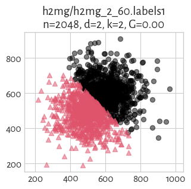

## h2mg/h2mg_2_70 (n=2048, d=2) 

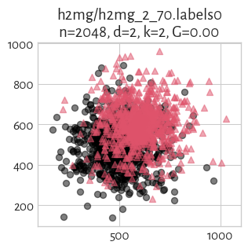
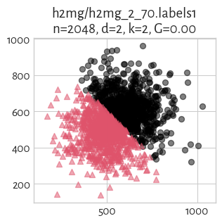

## h2mg/h2mg_2_80 (n=2048, d=2) 

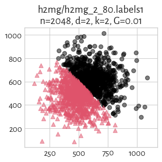

## h2mg/h2mg_2_90 (n=2048, d=2) 

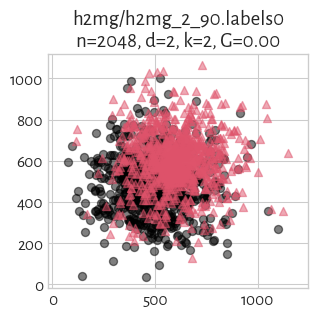
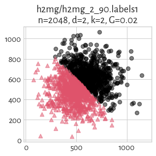

## h2mg/h2mg_4_10 (n=2048, d=4) 

#### `labels0`

true_k= 2, noise=    0, G=0.00

label_counts=[1024, 1024]

> **(preview generation suppressed)**

#### `labels1`

true_k= 2, noise=    0, G=0.00

label_counts=[1024, 1024]

> **(preview generation suppressed)**

## h2mg/h2mg_4_20 (n=2048, d=4) 

#### `labels0`

true_k= 2, noise=    0, G=0.00

label_counts=[1024, 1024]

> **(preview generation suppressed)**

#### `labels1`

true_k= 2, noise=    0, G=0.01

label_counts=[1017, 1031]

> **(preview generation suppressed)**

## h2mg/h2mg_4_30 (n=2048, d=4) 

#### `labels0`

true_k= 2, noise=    0, G=0.00

label_counts=[1024, 1024]

> **(preview generation suppressed)**

#### `labels1`

true_k= 2, noise=    0, G=0.01

label_counts=[1032, 1016]

> **(preview generation suppressed)**

## h2mg/h2mg_4_40 (n=2048, d=4) 

#### `labels0`

true_k= 2, noise=    0, G=0.00

label_counts=[1024, 1024]

> **(preview generation suppressed)**

#### `labels1`

true_k= 2, noise=    0, G=0.01

label_counts=[1031, 1017]

> **(preview generation suppressed)**

## h2mg/h2mg_4_50 (n=2048, d=4) 

#### `labels0`

true_k= 2, noise=    0, G=0.00

label_counts=[1024, 1024]

> **(preview generation suppressed)**

#### `labels1`

true_k= 2, noise=    0, G=0.00

label_counts=[1025, 1023]

> **(preview generation suppressed)**

## h2mg/h2mg_4_60 (n=2048, d=4) 

#### `labels0`

true_k= 2, noise=    0, G=0.00

label_counts=[1024, 1024]

> **(preview generation suppressed)**

#### `labels1`

true_k= 2, noise=    0, G=0.02

label_counts=[1047, 1001]

> **(preview generation suppressed)**

## h2mg/h2mg_4_70 (n=2048, d=4) 

#### `labels0`

true_k= 2, noise=    0, G=0.00

label_counts=[1024, 1024]

> **(preview generation suppressed)**

#### `labels1`

true_k= 2, noise=    0, G=0.02

label_counts=[1044, 1004]

> **(preview generation suppressed)**

## h2mg/h2mg_4_80 (n=2048, d=4) 

#### `labels0`

true_k= 2, noise=    0, G=0.00

label_counts=[1024, 1024]

> **(preview generation suppressed)**

#### `labels1`

true_k= 2, noise=    0, G=0.02

label_counts=[1047, 1001]

> **(preview generation suppressed)**

## h2mg/h2mg_4_90 (n=2048, d=4) 

#### `labels0`

true_k= 2, noise=    0, G=0.00

label_counts=[1024, 1024]

> **(preview generation suppressed)**

#### `labels1`

true_k= 2, noise=    0, G=0.02

label_counts=[1041, 1007]

> **(preview generation suppressed)**

## h2mg/h2mg_8_10 (n=2048, d=8) 

#### `labels0`

true_k= 2, noise=    0, G=0.00

label_counts=[1024, 1024]

> **(preview generation suppressed)**

#### `labels1`

true_k= 2, noise=    0, G=0.00

label_counts=[1024, 1024]

> **(preview generation suppressed)**

## h2mg/h2mg_8_20 (n=2048, d=8) 

#### `labels0`

true_k= 2, noise=    0, G=0.00

label_counts=[1024, 1024]

> **(preview generation suppressed)**

#### `labels1`

true_k= 2, noise=    0, G=0.00

label_counts=[1024, 1024]

> **(preview generation suppressed)**

## h2mg/h2mg_8_30 (n=2048, d=8) 

#### `labels0`

true_k= 2, noise=    0, G=0.00

label_counts=[1024, 1024]

> **(preview generation suppressed)**

#### `labels1`

true_k= 2, noise=    0, G=0.02

label_counts=[1043, 1005]

> **(preview generation suppressed)**

## h2mg/h2mg_8_40 (n=2048, d=8) 

#### `labels0`

true_k= 2, noise=    0, G=0.00

label_counts=[1024, 1024]

> **(preview generation suppressed)**

#### `labels1`

true_k= 2, noise=    0, G=0.02

label_counts=[1046, 1002]

> **(preview generation suppressed)**

## h2mg/h2mg_8_50 (n=2048, d=8) 

#### `labels0`

true_k= 2, noise=    0, G=0.00

label_counts=[1024, 1024]

> **(preview generation suppressed)**

#### `labels1`

true_k= 2, noise=    0, G=0.00

label_counts=[1027, 1021]

> **(preview generation suppressed)**

## h2mg/h2mg_8_60 (n=2048, d=8) 

#### `labels0`

true_k= 2, noise=    0, G=0.00

label_counts=[1024, 1024]

> **(preview generation suppressed)**

#### `labels1`

true_k= 2, noise=    0, G=0.00

label_counts=[1027, 1021]

> **(preview generation suppressed)**

## h2mg/h2mg_8_70 (n=2048, d=8) 

#### `labels0`

true_k= 2, noise=    0, G=0.00

label_counts=[1024, 1024]

> **(preview generation suppressed)**

#### `labels1`

true_k= 2, noise=    0, G=0.00

label_counts=[1027, 1021]

> **(preview generation suppressed)**

## h2mg/h2mg_8_80 (n=2048, d=8) 

#### `labels0`

true_k= 2, noise=    0, G=0.00

label_counts=[1024, 1024]

> **(preview generation suppressed)**

#### `labels1`

true_k= 2, noise=    0, G=0.01

label_counts=[1030, 1018]

> **(preview generation suppressed)**

## h2mg/h2mg_8_90 (n=2048, d=8) 

#### `labels0`

true_k= 2, noise=    0, G=0.00

label_counts=[1024, 1024]

> **(preview generation suppressed)**

#### `labels1`

true_k= 2, noise=    0, G=0.01

label_counts=[1034, 1014]

> **(preview generation suppressed)**

## h2mg/h2mg_16_10 (n=2048, d=16) 

#### `labels0`

true_k= 2, noise=    0, G=0.00

label_counts=[1024, 1024]

> **(preview generation suppressed)**

#### `labels1`

true_k= 2, noise=    0, G=0.00

label_counts=[1024, 1024]

> **(preview generation suppressed)**

## h2mg/h2mg_16_20 (n=2048, d=16) 

#### `labels0`

true_k= 2, noise=    0, G=0.00

label_counts=[1024, 1024]

> **(preview generation suppressed)**

#### `labels1`

true_k= 2, noise=    0, G=0.00

label_counts=[1028, 1020]

> **(preview generation suppressed)**

## h2mg/h2mg_16_30 (n=2048, d=16) 

#### `labels0`

true_k= 2, noise=    0, G=0.00

label_counts=[1024, 1024]

> **(preview generation suppressed)**

#### `labels1`

true_k= 2, noise=    0, G=0.00

label_counts=[1027, 1021]

> **(preview generation suppressed)**

## h2mg/h2mg_16_40 (n=2048, d=16) 

#### `labels0`

true_k= 2, noise=    0, G=0.00

label_counts=[1024, 1024]

> **(preview generation suppressed)**

#### `labels1`

true_k= 2, noise=    0, G=0.01

label_counts=[1014, 1034]

> **(preview generation suppressed)**

## h2mg/h2mg_16_50 (n=2048, d=16) 

#### `labels0`

true_k= 2, noise=    0, G=0.00

label_counts=[1024, 1024]

> **(preview generation suppressed)**

#### `labels1`

true_k= 2, noise=    0, G=0.02

label_counts=[1002, 1046]

> **(preview generation suppressed)**

## h2mg/h2mg_16_60 (n=2048, d=16) 

#### `labels0`

true_k= 2, noise=    0, G=0.00

label_counts=[1024, 1024]

> **(preview generation suppressed)**

#### `labels1`

true_k= 2, noise=    0, G=0.00

label_counts=[1020, 1028]

> **(preview generation suppressed)**

## h2mg/h2mg_16_70 (n=2048, d=16) 

#### `labels0`

true_k= 2, noise=    0, G=0.00

label_counts=[1024, 1024]

> **(preview generation suppressed)**

#### `labels1`

true_k= 2, noise=    0, G=0.01

label_counts=[1014, 1034]

> **(preview generation suppressed)**

## h2mg/h2mg_16_80 (n=2048, d=16) 

#### `labels0`

true_k= 2, noise=    0, G=0.00

label_counts=[1024, 1024]

> **(preview generation suppressed)**

#### `labels1`

true_k= 2, noise=    0, G=0.00

label_counts=[1021, 1027]

> **(preview generation suppressed)**

## h2mg/h2mg_16_90 (n=2048, d=16) 

#### `labels0`

true_k= 2, noise=    0, G=0.00

label_counts=[1024, 1024]

> **(preview generation suppressed)**

#### `labels1`

true_k= 2, noise=    0, G=0.00

label_counts=[1022, 1026]

> **(preview generation suppressed)**

## h2mg/h2mg_32_10 (n=2048, d=32) 

#### `labels0`

true_k= 2, noise=    0, G=0.00

label_counts=[1024, 1024]

> **(preview generation suppressed)**

#### `labels1`

true_k= 2, noise=    0, G=0.00

label_counts=[1025, 1023]

> **(preview generation suppressed)**

## h2mg/h2mg_32_20 (n=2048, d=32) 

#### `labels0`

true_k= 2, noise=    0, G=0.00

label_counts=[1024, 1024]

> **(preview generation suppressed)**

#### `labels1`

true_k= 2, noise=    0, G=0.01

label_counts=[1030, 1018]

> **(preview generation suppressed)**

## h2mg/h2mg_32_30 (n=2048, d=32) 

#### `labels0`

true_k= 2, noise=    0, G=0.00

label_counts=[1024, 1024]

> **(preview generation suppressed)**

#### `labels1`

true_k= 2, noise=    0, G=0.01

label_counts=[1017, 1031]

> **(preview generation suppressed)**

## h2mg/h2mg_32_40 (n=2048, d=32) 

#### `labels0`

true_k= 2, noise=    0, G=0.00

label_counts=[1024, 1024]

> **(preview generation suppressed)**

#### `labels1`

true_k= 2, noise=    0, G=0.02

label_counts=[1007, 1041]

> **(preview generation suppressed)**

## h2mg/h2mg_32_50 (n=2048, d=32) 

#### `labels0`

true_k= 2, noise=    0, G=0.00

label_counts=[1024, 1024]

> **(preview generation suppressed)**

#### `labels1`

true_k= 2, noise=    0, G=0.02

label_counts=[1005, 1043]

> **(preview generation suppressed)**

## h2mg/h2mg_32_60 (n=2048, d=32) 

#### `labels0`

true_k= 2, noise=    0, G=0.00

label_counts=[1024, 1024]

> **(preview generation suppressed)**

#### `labels1`

true_k= 2, noise=    0, G=0.01

label_counts=[1013, 1035]

> **(preview generation suppressed)**

## h2mg/h2mg_32_70 (n=2048, d=32) 

#### `labels0`

true_k= 2, noise=    0, G=0.00

label_counts=[1024, 1024]

> **(preview generation suppressed)**

#### `labels1`

true_k= 2, noise=    0, G=0.01

label_counts=[1016, 1032]

> **(preview generation suppressed)**

## h2mg/h2mg_32_80 (n=2048, d=32) 

#### `labels0`

true_k= 2, noise=    0, G=0.00

label_counts=[1024, 1024]

> **(preview generation suppressed)**

#### `labels1`

true_k= 2, noise=    0, G=0.00

label_counts=[1020, 1028]

> **(preview generation suppressed)**

## h2mg/h2mg_32_90 (n=2048, d=32) 

#### `labels0`

true_k= 2, noise=    0, G=0.00

label_counts=[1024, 1024]

> **(preview generation suppressed)**

#### `labels1`

true_k= 2, noise=    0, G=0.01

label_counts=[1016, 1032]

> **(preview generation suppressed)**

## h2mg/h2mg_64_10 (n=2048, d=64) 

#### `labels0`

true_k= 2, noise=    0, G=0.00

label_counts=[1024, 1024]

> **(preview generation suppressed)**

#### `labels1`

true_k= 2, noise=    0, G=0.00

label_counts=[1024, 1024]

> **(preview generation suppressed)**

## h2mg/h2mg_64_20 (n=2048, d=64) 

#### `labels0`

true_k= 2, noise=    0, G=0.00

label_counts=[1024, 1024]

> **(preview generation suppressed)**

#### `labels1`

true_k= 2, noise=    0, G=0.00

label_counts=[1021, 1027]

> **(preview generation suppressed)**

## h2mg/h2mg_64_30 (n=2048, d=64) 

#### `labels0`

true_k= 2, noise=    0, G=0.00

label_counts=[1024, 1024]

> **(preview generation suppressed)**

#### `labels1`

true_k= 2, noise=    0, G=0.01

label_counts=[1013, 1035]

> **(preview generation suppressed)**

## h2mg/h2mg_64_40 (n=2048, d=64) 

#### `labels0`

true_k= 2, noise=    0, G=0.00

label_counts=[1024, 1024]

> **(preview generation suppressed)**

#### `labels1`

true_k= 2, noise=    0, G=0.01

label_counts=[1017, 1031]

> **(preview generation suppressed)**

## h2mg/h2mg_64_50 (n=2048, d=64) 

#### `labels0`

true_k= 2, noise=    0, G=0.00

label_counts=[1024, 1024]

> **(preview generation suppressed)**

#### `labels1`

true_k= 2, noise=    0, G=0.00

label_counts=[1020, 1028]

> **(preview generation suppressed)**

## h2mg/h2mg_64_60 (n=2048, d=64) 

#### `labels0`

true_k= 2, noise=    0, G=0.00

label_counts=[1024, 1024]

> **(preview generation suppressed)**

#### `labels1`

true_k= 2, noise=    0, G=0.01

label_counts=[1013, 1035]

> **(preview generation suppressed)**

## h2mg/h2mg_64_70 (n=2048, d=64) 

#### `labels0`

true_k= 2, noise=    0, G=0.00

label_counts=[1024, 1024]

> **(preview generation suppressed)**

#### `labels1`

true_k= 2, noise=    0, G=0.01

label_counts=[1015, 1033]

> **(preview generation suppressed)**

## h2mg/h2mg_64_80 (n=2048, d=64) 

#### `labels0`

true_k= 2, noise=    0, G=0.00

label_counts=[1024, 1024]

> **(preview generation suppressed)**

#### `labels1`

true_k= 2, noise=    0, G=0.00

label_counts=[1020, 1028]

> **(preview generation suppressed)**

## h2mg/h2mg_64_90 (n=2048, d=64) 

#### `labels0`

true_k= 2, noise=    0, G=0.00

label_counts=[1024, 1024]

> **(preview generation suppressed)**

#### `labels1`

true_k= 2, noise=    0, G=0.00

label_counts=[1019, 1029]

> **(preview generation suppressed)**

## h2mg/h2mg_128_10 (n=2048, d=128) 

#### `labels0`

true_k= 2, noise=    0, G=0.00

label_counts=[1024, 1024]

> **(preview generation suppressed)**

#### `labels1`

true_k= 2, noise=    0, G=0.00

label_counts=[1026, 1022]

> **(preview generation suppressed)**

## h2mg/h2mg_128_20 (n=2048, d=128) 

#### `labels0`

true_k= 2, noise=    0, G=0.00

label_counts=[1024, 1024]

> **(preview generation suppressed)**

#### `labels1`

true_k= 2, noise=    0, G=0.01

label_counts=[1017, 1031]

> **(preview generation suppressed)**

## h2mg/h2mg_128_30 (n=2048, d=128) 

#### `labels0`

true_k= 2, noise=    0, G=0.00

label_counts=[1024, 1024]

> **(preview generation suppressed)**

#### `labels1`

true_k= 2, noise=    0, G=0.00

label_counts=[1026, 1022]

> **(preview generation suppressed)**

## h2mg/h2mg_128_40 (n=2048, d=128) 

#### `labels0`

true_k= 2, noise=    0, G=0.00

label_counts=[1024, 1024]

> **(preview generation suppressed)**

#### `labels1`

true_k= 2, noise=    0, G=0.01

label_counts=[1009, 1039]

> **(preview generation suppressed)**

## h2mg/h2mg_128_50 (n=2048, d=128) 

#### `labels0`

true_k= 2, noise=    0, G=0.00

label_counts=[1024, 1024]

> **(preview generation suppressed)**

#### `labels1`

true_k= 2, noise=    0, G=0.01

label_counts=[1013, 1035]

> **(preview generation suppressed)**

## h2mg/h2mg_128_60 (n=2048, d=128) 

#### `labels0`

true_k= 2, noise=    0, G=0.00

label_counts=[1024, 1024]

> **(preview generation suppressed)**

#### `labels1`

true_k= 2, noise=    0, G=0.01

label_counts=[1011, 1037]

> **(preview generation suppressed)**

## h2mg/h2mg_128_70 (n=2048, d=128) 

#### `labels0`

true_k= 2, noise=    0, G=0.00

label_counts=[1024, 1024]

> **(preview generation suppressed)**

#### `labels1`

true_k= 2, noise=    0, G=0.01

label_counts=[1009, 1039]

> **(preview generation suppressed)**

## h2mg/h2mg_128_80 (n=2048, d=128) 

#### `labels0`

true_k= 2, noise=    0, G=0.00

label_counts=[1024, 1024]

> **(preview generation suppressed)**

#### `labels1`

true_k= 2, noise=    0, G=0.01

label_counts=[1009, 1039]

> **(preview generation suppressed)**

## h2mg/h2mg_128_90 (n=2048, d=128) 

#### `labels0`

true_k= 2, noise=    0, G=0.00

label_counts=[1024, 1024]

> **(preview generation suppressed)**

#### `labels1`

true_k= 2, noise=    0, G=0.01

label_counts=[1011, 1037]

> **(preview generation suppressed)**

