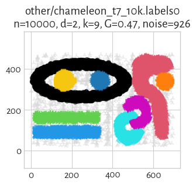
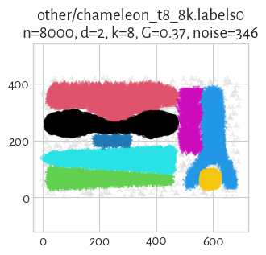
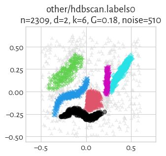
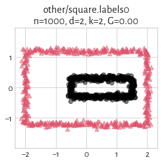

The **[Framework for Benchmarking Clustering Algorithms](https://clustering-benchmarks.gagolewski.com)
is authored/edited/maintained by [Marek Gagolewski](https://www.gagolewski.com)**

--------------------------------------------------------------------------------

**Datasets**

* [other/chameleon_t4_8k](#chameleon_t4_8k)
* [other/chameleon_t5_8k](#chameleon_t5_8k)
* [other/chameleon_t7_10k](#chameleon_t7_10k)
* [other/chameleon_t8_8k](#chameleon_t8_8k)
* [other/hdbscan](#hdbscan)
* [other/iris](#iris)
* [other/iris5](#iris5)
* [other/square](#square)

--------------------------------------------------------------------------------

## other/chameleon_t4_8k (n=8000, d=2) 

    It is often suggested that the source is: G. Karypis, E.H. Han, V. Kumar,
    CHAMELEON: A hierarchical clustering algorithm using dynamic modeling,
    IEEE Transactions on Computers 32(8), 68-75, 1999.
    Yet, such a dataset is not mentioned in this paper.
    
    Web: http://glaros.dtc.umn.edu/gkhome/cluto/cluto/download
    
    `labels0` generated by A. Cena and M. Gagolewski.
    `0` denotes the noise class (if present).
    

#### `labels0`

true_k= 6, noise=  761

label_counts=[1741, 1669, 1559, 965, 658, 647]

## other/chameleon_t5_8k (n=8000, d=2) 

    It is often suggested that the source is:  G. Karypis, E.H. Han, V. Kumar,
    CHAMELEON: A hierarchical clustering algorithm using dynamic modeling,
    IEEE Transactions on Computers 32(8), 68-75, 1999.
    Yet, such a dataset is not mentioned in this paper.
    
    Web: http://glaros.dtc.umn.edu/gkhome/cluto/cluto/download
    
    `labels0` generated by M. Gagolewski.
    `0` denotes the noise class (if present).
    

#### `labels0`

true_k= 6, noise= 1187

label_counts=[1193, 1188, 1166, 1160, 1056, 1050]

## other/chameleon_t7_10k (n=10000, d=2) 

    Source: G. Karypis, E.H. Han, V. Kumar,
    CHAMELEON: A hierarchical clustering algorithm using dynamic modeling,
    IEEE Transactions on Computers 32(8), 68-75, 1999.
    
    Web: http://glaros.dtc.umn.edu/gkhome/cluto/cluto/download
    
    `labels0` generated by M. Gagolewski.
    `0` denotes the noise class (if present).
    

#### `labels0`

true_k= 9, noise=  926

label_counts=[2722, 2198, 1031, 975, 615, 589, 349, 332, 263]

## other/chameleon_t8_8k (n=8000, d=2) 

    Source: G. Karypis, E.H. Han, V. Kumar,
    CHAMELEON: A hierarchical clustering algorithm using dynamic modeling,
    IEEE Transactions on Computers 32(8), 68-75, 1999.
    
    Web: http://glaros.dtc.umn.edu/gkhome/cluto/cluto/download
    
    `labels0` generated by M. Gagolewski.
    `0` denotes the noise class (if present).
    

#### `labels0`

true_k= 8, noise=  346

label_counts=[1554, 1451, 1450, 1383, 1110, 350, 181, 175]

## other/hdbscan (n=2309, d=2) 

    Source: A high performance implementation of HDBSCAN clustering.
    http://hdbscan.readthedocs.io/en/latest/ Copyright (c) 2015, Leland McInnes;
    https://github.com/scikit-learn-contrib/hdbscan/blob/master/notebooks/clusterable_data.npy
    
    McInnes L., Healy J., Astels S. (2017),
    hdbscan: Hierarchical density based clustering,
    Journal of Open Source Software, 2(11), 205, DOI: 10.21105/joss.00205.
    
    `labels0` generated by M. Gagolewski. `0` denotes the noise class.
    

#### `labels0`

true_k= 6, noise=  510

label_counts=[410, 366, 326, 306, 207, 184]

## other/iris (n=150, d=4) 

    The (? - see below) famous Fisher's *iris* data set.
    
    Source: Fisher R.A. (1936). The use of multiple measurements in taxonomic
    problems, Annual Eugenics 7, pp. 179-188.
    
    Note that there are many flavours of this dataset available on the internet.
    Here, we use the one available in the R package `datasets`
    (as of R version 3.5.1). In particular, the one available in the UCI repository
    has errors in rows #35 and #38.
    
    For discussion, see: Bezdek J.C. et al. (1999). Will the real iris data please
    stand up?, IEEE Transactions on Fuzzy Systems 7(3), pp. 368-369.
    doi:10.1109/91.771092
    
    A rather small dataset, where one point group is clearly well-separated.
    
    Datapoints are encoded with 1 decimal digits precision, hence
    the pairwise point distance matrix might have non-unique entries.
    

#### `labels0`

true_k= 3, noise=    0

label_counts=[50, 50, 50]

> **(preview generation suppressed)**

## other/iris5 (n=105, d=4) 

    An imbalanced version of the famous Fisher's *iris* data set,
    in which we take only 5 last observations from the 1st group (*iris setosa*).
    This benchmark set was proposed in Gagolewski M., Bartoszuk M., Cena A. (2016).
    Genie: A new, fast, and outlier-resistant hierarchical clustering algorithm,
    Information Sciences 363, pp. 8-23. doi:10.1016/j.ins.2016.05.003
    
    Source: Fisher R.A. (1936). The use of multiple measurements in taxonomic
    problems, Annual Eugenics 7, pp. 179-188.
    
    Note that there are many flavours of this dataset available on the internet.
    Here, we use the one available in the R package `datasets`
    (as of R version 3.5.1).
    

#### `labels0`

true_k= 3, noise=    0

label_counts=[5, 50, 50]

> **(preview generation suppressed)**

## other/square (n=1000, d=2) 

    Source:  <unknown>
    
    `labels0` generated by M. Gagolewski. `0` denotes the noise class (if present)
    

#### `labels0`

true_k= 2, noise=    0

label_counts=[500, 500]

