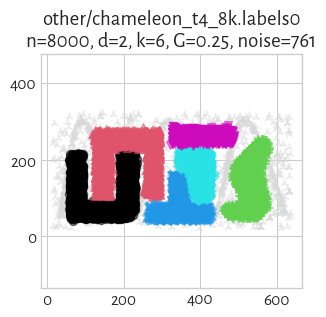
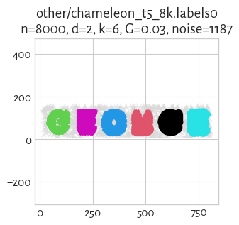

The **[Framework for Benchmarking Clustering Algorithms](https://clustering-benchmarks.gagolewski.com)
is authored/edited/maintained by [Marek Gagolewski](https://www.gagolewski.com)**

[Benchmark suite](https://github.com/gagolews/clustering-data-v1) version 1.1.0

--------------------------------------------------------------------------------

**Datasets**

* [other/chameleon_t4_8k](#chameleon_t4_8k)
* [other/chameleon_t5_8k](#chameleon_t5_8k)
* [other/chameleon_t7_10k](#chameleon_t7_10k)
* [other/chameleon_t8_8k](#chameleon_t8_8k)
* [other/hdbscan](#hdbscan)
* [other/iris](#iris)
* [other/iris5](#iris5)
* [other/square](#square)

--------------------------------------------------------------------------------

## other/chameleon_t4_8k (n=8000, d=2) 

## other/chameleon_t5_8k (n=8000, d=2) 

## other/chameleon_t7_10k (n=10000, d=2) 

## other/chameleon_t8_8k (n=8000, d=2) 

## other/hdbscan (n=2309, d=2) 

## other/iris (n=150, d=4) 

#### `labels0`

true_k= 3, noise=    0, G=0.00

label_counts=[50, 50, 50]

> **(preview generation suppressed)**

## other/iris5 (n=105, d=4) 

#### `labels0`

true_k= 3, noise=    0, G=0.43

label_counts=[5, 50, 50]

> **(preview generation suppressed)**

## other/square (n=1000, d=2) 

