The **[Framework for Benchmarking Clustering Algorithms](https://clustering-benchmarks.gagolewski.com)
is authored/edited/maintained by [Marek Gagolewski](https://www.gagolewski.com)**

[Benchmark suite](https://github.com/gagolews/clustering-data-v1) version 1.1.0

--------------------------------------------------------------------------------

**Datasets**

* [sipu/a1](#a1)
* [sipu/a2](#a2)
* [sipu/a3](#a3)
* [sipu/aggregation](#aggregation)
* [sipu/birch1](#birch1)
* [sipu/birch2](#birch2)
* [sipu/compound](#compound)
* [sipu/d31](#d31)
* [sipu/flame](#flame)
* [sipu/jain](#jain)
* [sipu/pathbased](#pathbased)
* [sipu/r15](#r15)
* [sipu/s1](#s1)
* [sipu/s2](#s2)
* [sipu/s3](#s3)
* [sipu/s4](#s4)
* [sipu/spiral](#spiral)
* [sipu/unbalance](#unbalance)
* [sipu/worms_2](#worms_2)
* [sipu/worms_64](#worms_64)

--------------------------------------------------------------------------------

## sipu/a1 (n=3000, d=2) 

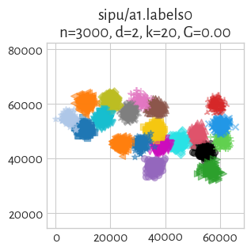

## sipu/a2 (n=5250, d=2) 

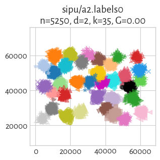

## sipu/a3 (n=7500, d=2) 

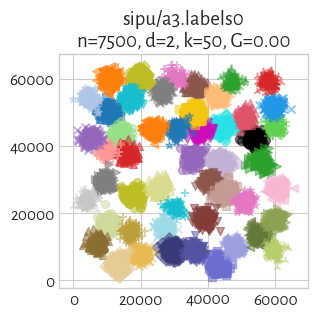

## sipu/aggregation (n=788, d=2) 

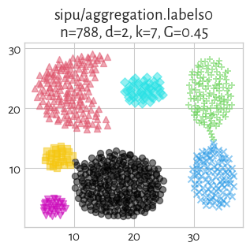

## sipu/birch1 (n=100000, d=2) 

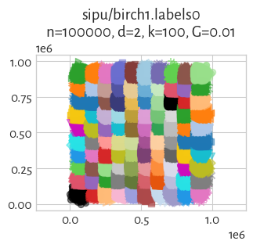

## sipu/birch2 (n=100000, d=2) 

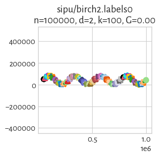

## sipu/compound (n=399, d=2) 

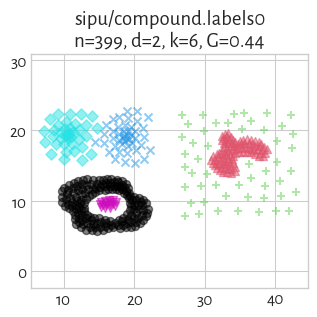
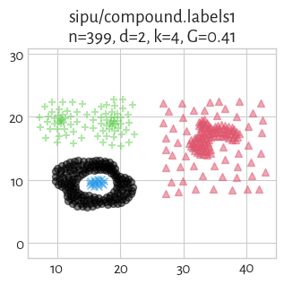
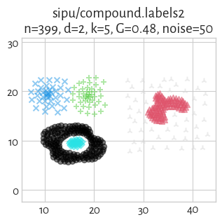
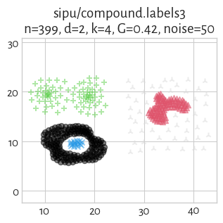
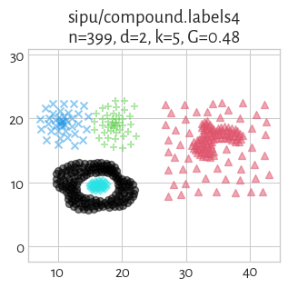

## sipu/d31 (n=3100, d=2) 

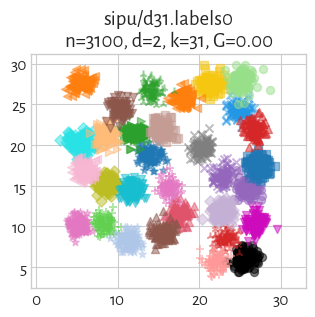

## sipu/flame (n=240, d=2) 

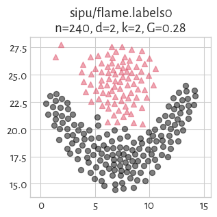
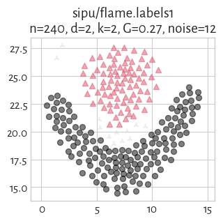

## sipu/jain (n=373, d=2) 

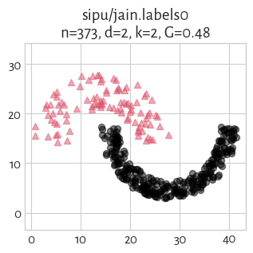

## sipu/pathbased (n=300, d=2) 

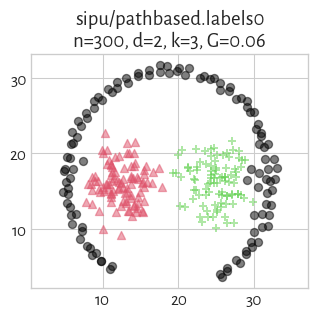

## sipu/r15 (n=600, d=2) 

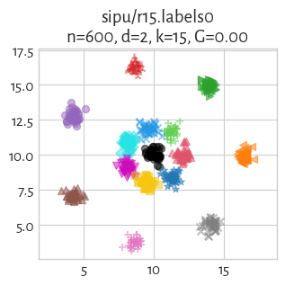
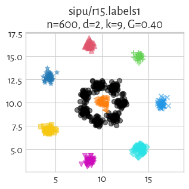
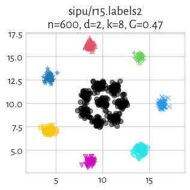

## sipu/s1 (n=5000, d=2) 

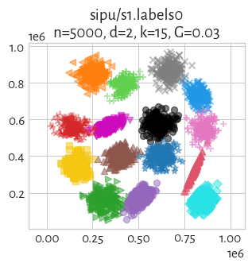

## sipu/s2 (n=5000, d=2) 

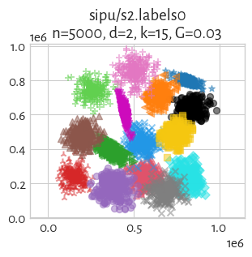

## sipu/s3 (n=5000, d=2) 

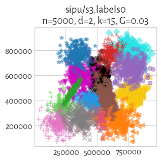

## sipu/s4 (n=5000, d=2) 

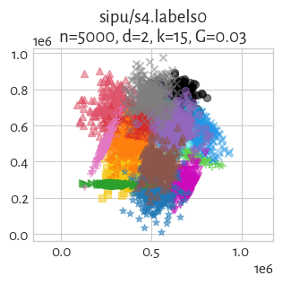

## sipu/spiral (n=312, d=2) 

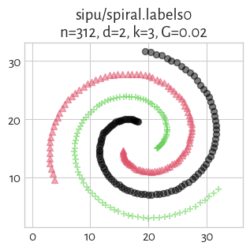

## sipu/unbalance (n=6500, d=2) 

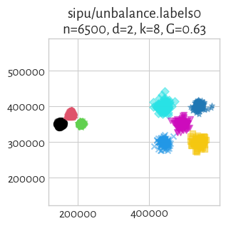

## sipu/worms_2 (n=105600, d=2) 

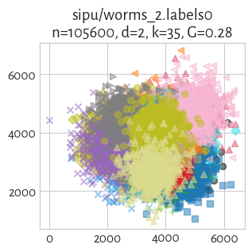

## sipu/worms_64 (n=105000, d=64) 

#### `labels0`

true_k=25, noise=    0, G=0.00

label_counts=[4200, 4200, 4200, 4200, 4200, 4200, 4200, 4200, 4200, 4200, 4200, 4200, 4200, 4200, 4200, 4200, 4200, 4200, 4200, 4200, 4200, 4200, 4200, 4200, 4200]

> **(preview generation suppressed)**

