The **[Framework for Benchmarking Clustering Algorithms](https://clustering-benchmarks.gagolewski.com)
is authored/edited/maintained by [Marek Gagolewski](https://www.gagolewski.com)**

[Benchmark suite](https://github.com/gagolews/clustering-data-v1) version 1.1.0

--------------------------------------------------------------------------------

**Datasets**

* [wut/circles](#circles)
* [wut/cross](#cross)
* [wut/graph](#graph)
* [wut/isolation](#isolation)
* [wut/labirynth](#labirynth)
* [wut/mk1](#mk1)
* [wut/mk2](#mk2)
* [wut/mk3](#mk3)
* [wut/mk4](#mk4)
* [wut/olympic](#olympic)
* [wut/smile](#smile)
* [wut/stripes](#stripes)
* [wut/trajectories](#trajectories)
* [wut/trapped_lovers](#trapped_lovers)
* [wut/twosplashes](#twosplashes)
* [wut/windows](#windows)
* [wut/x1](#x1)
* [wut/x2](#x2)
* [wut/x3](#x3)
* [wut/z1](#z1)
* [wut/z2](#z2)
* [wut/z3](#z3)

--------------------------------------------------------------------------------

## wut/circles (n=4000, d=2) 

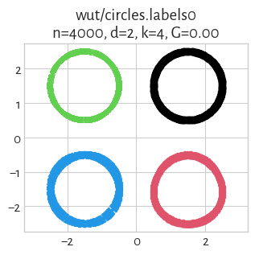

## wut/cross (n=2000, d=2) 

## wut/graph (n=2500, d=2) 

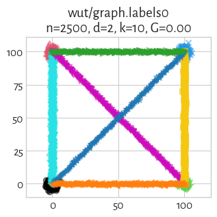

## wut/isolation (n=9000, d=2) 

## wut/labirynth (n=3546, d=2) 

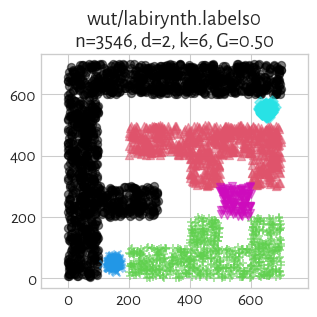

## wut/mk1 (n=300, d=2) 

## wut/mk2 (n=1000, d=2) 

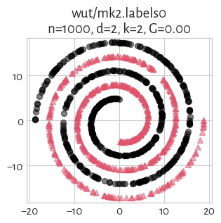

## wut/mk3 (n=600, d=3) 

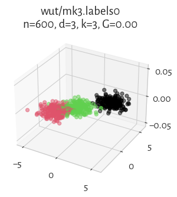

## wut/mk4 (n=1500, d=3) 

## wut/olympic (n=5000, d=2) 

## wut/smile (n=1000, d=2) 

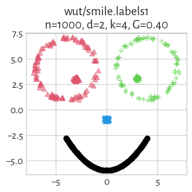

## wut/stripes (n=5000, d=2) 

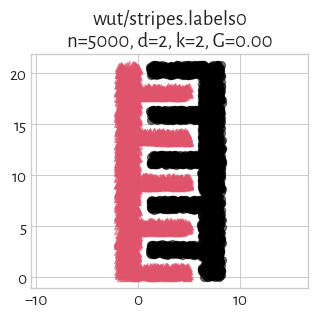

## wut/trajectories (n=10000, d=2) 

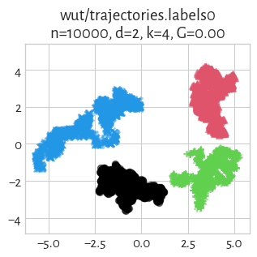

## wut/trapped_lovers (n=5000, d=3) 

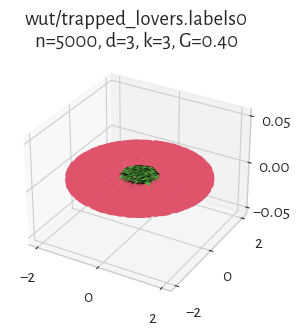

## wut/twosplashes (n=400, d=2) 

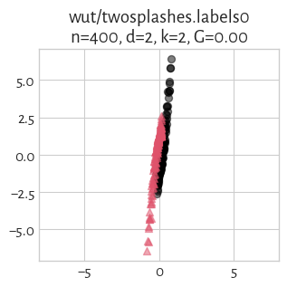

## wut/windows (n=2977, d=2) 

## wut/x1 (n=120, d=2) 

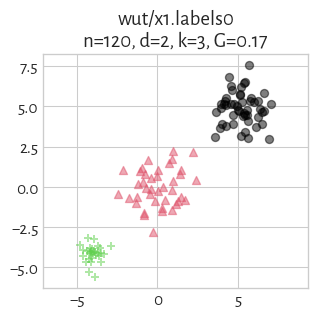

## wut/x2 (n=120, d=2) 

## wut/x3 (n=185, d=2) 

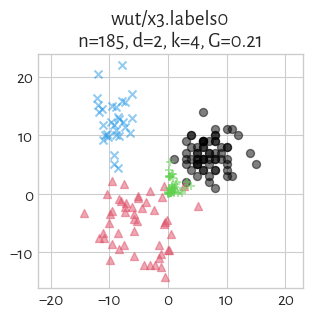
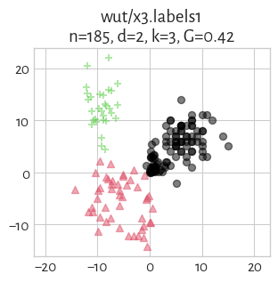

## wut/z1 (n=192, d=2) 

## wut/z2 (n=900, d=2) 

## wut/z3 (n=1000, d=2) 

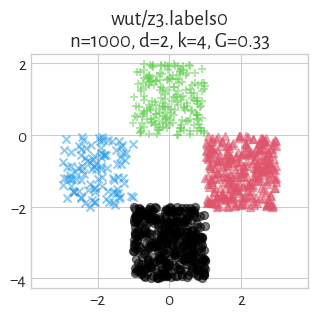

