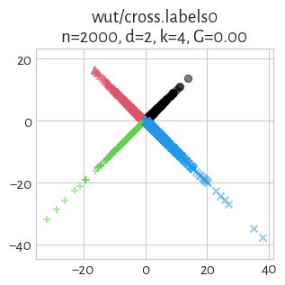
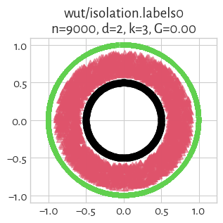
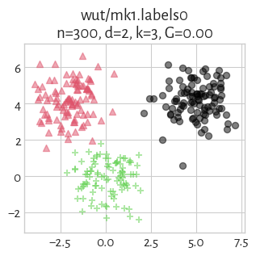
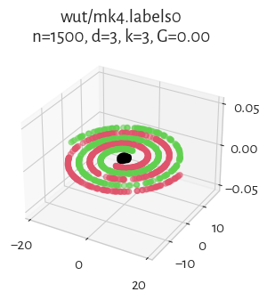
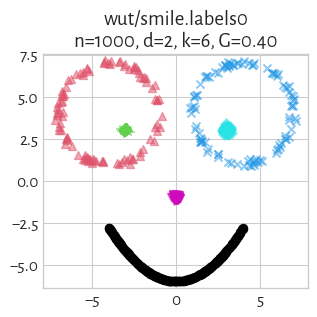
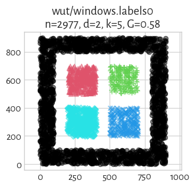
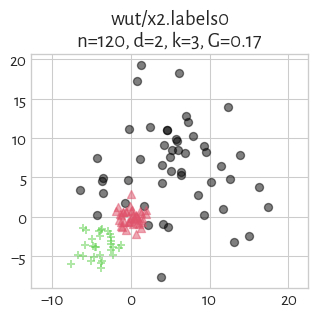
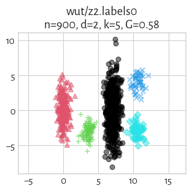

The **[Framework for Benchmarking Clustering Algorithms](https://clustering-benchmarks.gagolewski.com)
is authored/edited/maintained by [Marek Gagolewski](https://www.gagolewski.com)**

--------------------------------------------------------------------------------

**Datasets**

* [wut/circles](#circles)
* [wut/cross](#cross)
* [wut/graph](#graph)
* [wut/isolation](#isolation)
* [wut/labirynth](#labirynth)
* [wut/mk1](#mk1)
* [wut/mk2](#mk2)
* [wut/mk3](#mk3)
* [wut/mk4](#mk4)
* [wut/olympic](#olympic)
* [wut/smile](#smile)
* [wut/stripes](#stripes)
* [wut/trajectories](#trajectories)
* [wut/trapped_lovers](#trapped_lovers)
* [wut/twosplashes](#twosplashes)
* [wut/windows](#windows)
* [wut/x1](#x1)
* [wut/x2](#x2)
* [wut/x3](#x3)
* [wut/z1](#z1)
* [wut/z2](#z2)
* [wut/z3](#z3)

--------------------------------------------------------------------------------

## wut/circles (n=4000, d=2) 

    Set name: Circles
    Author: Aleksander Truszczyński (Warsaw University of Technology)
    
    Copyleft 2019
    Licensed under the Creative Commons Attribution 4.0 International License.
    see https://creativecommons.org/licenses/by/4.0/
    
    
    `labels0` come from the Author himself.
    

#### `labels0`

true_k= 4, noise=    0

label_counts=[1000, 1000, 1000, 1000]

## wut/cross (n=2000, d=2) 

    Author: Przemysław Kosewski (Warsaw University of Technology)
    
    `labels0` come from the Author himself.
    `0` denotes the noise class (if present).
    

#### `labels0`

true_k= 4, noise=    0

label_counts=[500, 500, 500, 500]

## wut/graph (n=2500, d=2) 

    Author: Adam Wawrzeńczyk (Warsaw University of Technology)
    
    Copyleft 2019
    Licensed under the Creative Commons Attribution 4.0 International License.
    see https://creativecommons.org/licenses/by/4.0/
    
    `labels0` come from the Author himself.
    `0` denotes the noise class (if present).
    

#### `labels0`

true_k=10, noise=    0

label_counts=[250, 250, 250, 250, 250, 250, 250, 250, 250, 250]

## wut/isolation (n=9000, d=2) 

    Set name: Isolation
    Author: Aleksander Truszczyński (Warsaw University of Technology)
    
    
    Copyleft 2019
    Licensed under the Creative Commons Attribution 4.0 International License.
    see https://creativecommons.org/licenses/by/4.0/
    
    `labels0` come from the Author himself.
    

#### `labels0`

true_k= 3, noise=    0

label_counts=[3000, 3000, 3000]

## wut/labirynth (n=3546, d=2) 

    Author: Adam Wawrzeńczyk (Warsaw University of Technology)
    
    Copyleft 2019
    Licensed under the Creative Commons Attribution 4.0 International License.
    see https://creativecommons.org/licenses/by/4.0/
    
    `labels0` come from the Author himself.
    `0` denotes the noise class (if present).
    

#### `labels0`

true_k= 6, noise=    0

label_counts=[1502, 722, 719, 250, 250, 103]

## wut/mk1 (n=300, d=2) 

    Author: Mateusz Kobyłka (Warsaw University of Technology)
    
    Copyleft 2019
    Licensed under the Creative Commons Attribution 4.0 International License.
    see https://creativecommons.org/licenses/by/4.0/
    
    `labels0` come from the Author himself.
    

#### `labels0`

true_k= 3, noise=    0

label_counts=[100, 100, 100]

## wut/mk2 (n=1000, d=2) 

    Author: Mateusz Kobyłka (Warsaw University of Technology)
    
    Copyleft 2019
    Licensed under the Creative Commons Attribution 4.0 International License.
    see https://creativecommons.org/licenses/by/4.0/
    
    `labels0` come from the Author himself.
    

#### `labels0`

true_k= 2, noise=    0

label_counts=[500, 500]

## wut/mk3 (n=600, d=3) 

    Author: Mateusz Kobyłka (Warsaw University of Technology)
    
    Copyleft 2019
    Licensed under the Creative Commons Attribution 4.0 International License.
    see https://creativecommons.org/licenses/by/4.0/
    
    `labels0` come from the Author himself.
    

#### `labels0`

true_k= 3, noise=    0

label_counts=[200, 200, 200]

## wut/mk4 (n=1500, d=3) 

    Author: Mateusz Kobyłka (Warsaw University of Technology)
    
    Copyleft 2019
    Licensed under the Creative Commons Attribution 4.0 International License.
    see https://creativecommons.org/licenses/by/4.0/
    
    `labels0` come from the Author himself.
    

#### `labels0`

true_k= 3, noise=    0

label_counts=[500, 500, 500]

## wut/olympic (n=5000, d=2) 

    Author: Michał Maciąg (Warsaw University of Technology)
    
    
    Copyleft 2019
    Licensed under the Creative Commons Attribution 4.0 International License.
    see https://creativecommons.org/licenses/by/4.0/
    
    `labels0` come from the Author himself.
    

#### `labels0`

true_k= 5, noise=    0

label_counts=[1000, 1000, 1000, 1000, 1000]

## wut/smile (n=1000, d=2) 

    Author: Przemyslaw Kosewski (Warsaw University of Technology)
    
    `labels0` come from the Author himself.
    `labels1` generated by M. Gagolewski.
    `0` denotes the noise class (if present).
    

#### `labels0`

true_k= 6, noise=    0

label_counts=[500, 100, 100, 100, 100, 100]

#### `labels1`

true_k= 4, noise=    0

label_counts=[500, 200, 200, 100]

## wut/stripes (n=5000, d=2) 

    Author: Michał Maciąg (Warsaw University of Technology)
    
    
    Copyleft 2019
    Licensed under the Creative Commons Attribution 4.0 International License.
    see https://creativecommons.org/licenses/by/4.0/
    
    `labels0` come from the Author himself.
    

#### `labels0`

true_k= 2, noise=    0

label_counts=[2500, 2500]

## wut/trajectories (n=10000, d=2) 

    Author: Michał Maciąg (Warsaw University of Technology)
    
    
    Copyleft 2019
    Licensed under the Creative Commons Attribution 4.0 International License.
    see https://creativecommons.org/licenses/by/4.0/
    
    `labels0` come from the Author himself.
    

#### `labels0`

true_k= 4, noise=    0

label_counts=[2500, 2500, 2500, 2500]

## wut/trapped_lovers (n=5000, d=3) 

    Set name: Trapped Lovers
    Author: Aleksander Truszczyński (Warsaw University of Technology)
    
    
    Copyleft 2019
    Licensed under the Creative Commons Attribution 4.0 International License.
    see https://creativecommons.org/licenses/by/4.0/
    
    `labels0` come from the Author himself.
    

#### `labels0`

true_k= 3, noise=    0

label_counts=[1000, 3000, 1000]

## wut/twosplashes (n=400, d=2) 

    Author: Jędrzej Krauze (Warsaw University of Technology)
    
    `labels0` come from the Author himself.
    `0` denotes the noise class (if present).
    

#### `labels0`

true_k= 2, noise=    0

label_counts=[200, 200]

## wut/windows (n=2977, d=2) 

    Author: Adam Wawrzeńczyk (Warsaw University of Technology)
    
    Copyleft 2019
    Licensed under the Creative Commons Attribution 4.0 International License.
    see https://creativecommons.org/licenses/by/4.0/
    
    `labels0` come from the Author himself.
    `0` denotes the noise class (if present).
    

#### `labels0`

true_k= 5, noise=    0

label_counts=[1943, 284, 264, 246, 240]

## wut/x1 (n=120, d=2) 

    Author: Eliza Kaczorek (Warsaw University of Technology)
    
    `labels0` come from the Author herself.
    `0` denotes the noise class (if present).
    

#### `labels0`

true_k= 3, noise=    0

label_counts=[50, 40, 30]

## wut/x2 (n=120, d=2) 

    Author: Eliza Kaczorek (Warsaw University of Technology)
    
    `labels0` come from the Author herself.
    `labels1` were generated by Marek Gagolewski.
    `0` denotes the noise class (if present).
    

#### `labels0`

true_k= 3, noise=    0

label_counts=[50, 40, 30]

#### `labels1`

true_k= 4, noise=   10

label_counts=[22, 46, 31, 11]

## wut/x3 (n=185, d=2) 

    Author: Eliza Kaczorek (Warsaw University of Technology)
    
    `labels0` come from the Author herself.
    `labels1` were generated by Marek Gagolewski.
    `0` denotes the noise class (if present).
    

#### `labels0`

true_k= 4, noise=    0

label_counts=[65, 50, 40, 30]

#### `labels1`

true_k= 3, noise=    0

label_counts=[108, 47, 30]

## wut/z1 (n=192, d=2) 

    Author: Anna Gierlak (Warsaw University of Technology)
    
    `labels0` come from the Author herself.
    `0` denotes the noise class (if present).
    

#### `labels0`

true_k= 3, noise=    0

label_counts=[64, 64, 64]

## wut/z2 (n=900, d=2) 

    Author: Anna Gierlak (Warsaw University of Technology)
    
    `labels0` come from the Author herself.
    `0` denotes the noise class (if present).
    

#### `labels0`

true_k= 5, noise=    0

label_counts=[500, 200, 100, 50, 50]

## wut/z3 (n=1000, d=2) 

    Author: Anna Gierlak (Warsaw University of Technology)
    
    `labels0` come from the Author herself.
    `0` denotes the noise class (if present).
    

#### `labels0`

true_k= 4, noise=    0

label_counts=[400, 300, 200, 100]

